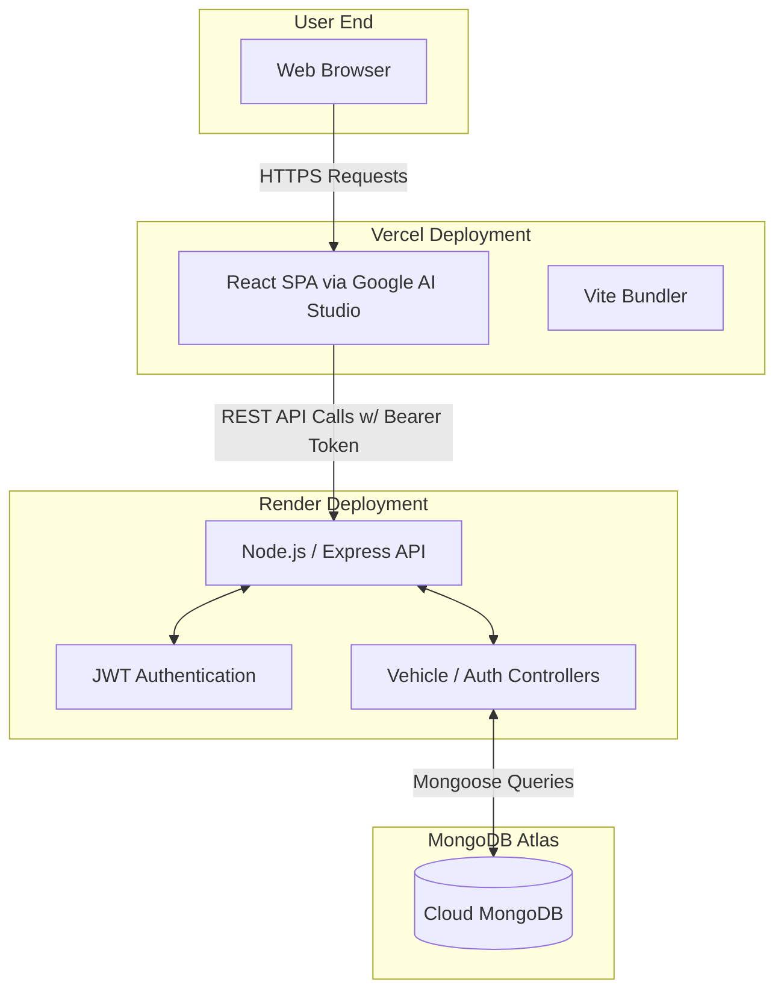

# 🏎️ Carventory - Modern Car Dealership Inventory System

[](#)
[](#)
[](#)
[](#)
[](#)

Carventory is a high-performance, full-stack car dealership inventory management system. It features a secure role-based backend API and a beautiful, modern React frontend. 

It provides an interactive dashboard for users to browse and purchase vehicles, and an exclusive admin panel for managing the inventory (adding, editing, restocking, and deleting vehicles).

---

## 🛠️ Tech Stack

### Frontend
- **Framework:** React + Vite
- **Styling:** Tailwind CSS v4, Glassmorphism UI
- **Animations & Icons:** Framer Motion, Lucide React
- **Routing:** React Router DOM
- **Network:** Axios (with interceptors)
- **Generation:** **Google AI Studio**

### Backend
- **Runtime:** Node.js
- **Framework:** Express.js 5.x
- **Database:** MongoDB Atlas (Mongoose ODM)
- **Security:** Helmet, express-rate-limit, express-validator
- **Auth:** JSON Web Tokens (JWT), bcrypt

### Testing & DevOps
- **Testing:** Jest, Supertest, MongoDB Memory Server
- **Hosting:** Vercel (Frontend) & Render (Backend API)

---

## 🏗️ System Architecture & Flowchart

Carventory is decoupled into a headless backend API and a standalone frontend application. 



---

## 📂 File Architecture

```text
carventory/
├── frontend/                # Frontend built via Google AI Studio
│   ├── public/              # Static assets
│   ├── src/
│   │   ├── api/             # Axios client and interceptors
│   │   ├── components/      # Reusable UI (Modals, Toasts, Cards)
│   │   ├── context/         # AuthContext, VehicleContext
│   │   ├── pages/           # Login, Register, Dashboard views
│   │   ├── App.jsx          # Router & Layout
│   │   └── main.jsx         # React Entry Point
│   ├── vite.config.ts       # Vite config (API proxy)
│   └── package.json
├── src/                     # Backend Source Code
│   ├── config/
│   │   ├── db.js            # MongoDB connection logic
│   │   └── seed.js          # DB seeder (Admin & Demo vehicles)
│   ├── controllers/         # authController, vehicleController
│   ├── middleware/          # JWT auth, role validation, validators
│   ├── models/              # Mongoose schemas (User, Vehicle)
│   ├── routes/              # Express API route definitions
│   ├── app.js               # Express application & middleware setup
│   └── server.js            # Server entry point
├── tests/                   # Backend TDD test suites
├── .env.example             # Environment variables template
├── PROMPTS.md               # Complete AI Prompt History Log
├── README.md
└── package.json             # Backend dependencies & scripts
```

---

## 🔐 Environment Variables

Create a `.env` file in the root directory.

```env
# Backend Configuration
PORT=5000
MONGODB_URI=mongodb+srv://<user>:<password>@cluster.mongodb.net/carventory
JWT_SECRET=your_super_secret_jwt_key
CORS_ORIGIN=https://carventory.vercel.app  # URL of your Vercel frontend

# Database Seeder (Run via `npm run seed`)
ADMIN_USERNAME=admin
ADMIN_EMAIL=admin@carventory.com
ADMIN_PASSWORD=Admin@123!
```

Create a `.env` file in the `frontend/` directory for Vercel:

```env
# Point to your Render Backend
VITE_API_URL=https://carventory.onrender.com/api
```

---

## 💻 Local Development Setup

1. **Install Backend Dependencies**
   ```bash
   npm install
   ```
2. **Install Frontend Dependencies**
   ```bash
   cd frontend
   npm install
   ```
3. **Seed the Database (Required)**
   *Populates the database with the initial Admin account and 8 demo vehicles.*
   ```bash
   npm run seed
   ```
4. **Start Development Servers**
   - Backend: `npm run dev` (Runs on http://localhost:5000)
   - Frontend: `npm run dev --prefix frontend` (Runs on http://localhost:5173)

---

## 🚀 Deployment Guide (Option 2: Decoupled)

### 1. MongoDB Atlas
- Create a cluster on [MongoDB Atlas](https://www.mongodb.com/cloud/atlas).
- Under **Network Access**, add `0.0.0.0/0` (Allow Access from Anywhere) so Render can connect.
- Copy your connection string.

### 2. Backend (Render)
- Connect your GitHub repository to a new **Web Service**.
- **Build Command:** `npm install`
- **Start Command:** `npm start`
- Add your Environment Variables: `MONGODB_URI`, `JWT_SECRET`, `CORS_ORIGIN`.

### 3. Frontend (Vercel)
- Import your repository into Vercel.
- Set the **Root Directory** to `frontend`.
- Set the Framework Preset to **Vite**.
- Add the Environment Variable: `VITE_API_URL` (pointing to your Render URL).

---

## 🤖 AI Usage in This Project

This project stands as a testament to advanced AI-assisted software engineering. The entire application was scaffolded, built, tested, and deployed with the collaboration of powerful AI models. 

### Highlights of AI Collaboration:
1. **Google AI Studio (Frontend Generation):** 
   The beautiful, glassmorphism-styled React SPA located in the `frontend/` directory was entirely generated via **Google AI Studio**. It utilizes Tailwind CSS, Framer Motion, and Lucide React to deliver a premium user experience out of the box.
2. **Test-Driven Development (TDD):** 
   The backend was built strictly adhering to TDD. AI assistants (Gemini & Claude) were instructed to write failing Jest/Supertest assertions *before* implementing the Mongoose schemas and Express controllers, ensuring a robust, bug-free foundation.
3. **Security & Auditing:** 
   Claude Sonnet 4.6 performed a comprehensive multi-file audit of the initial architecture, identifying and rectifying 15 crucial security vulnerabilities (such as mass-assignment risks, wildcard CORS, and missing rate-limiters).
4. **DevOps & Troubleshooting:** 
   AI was utilized to decouple the monolithic architecture, configure reverse proxies for `express-rate-limit`, resolve Express 5 `path-to-regexp` incompatibilities, and manage environment synchronization between Vercel, Render, and MongoDB Atlas.

> **Prompt History:** A complete, unedited log of every prompt and AI response used to construct this project is preserved in the `PROMPTS.md` file.
